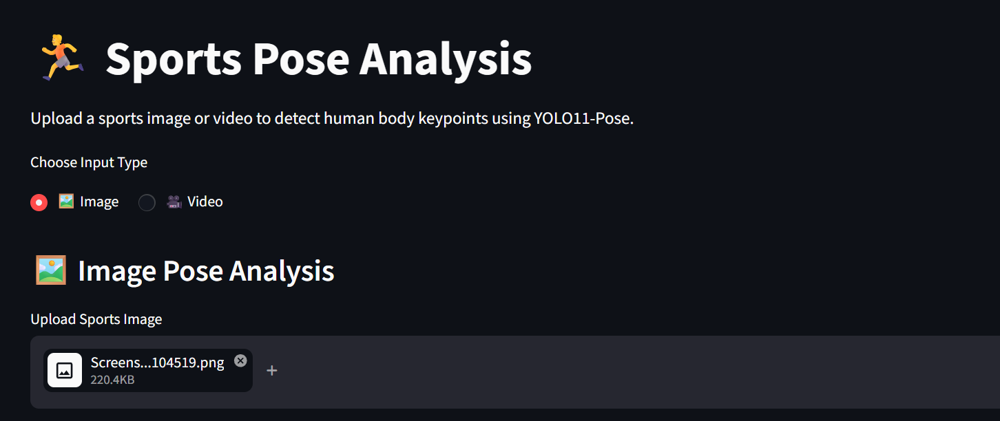
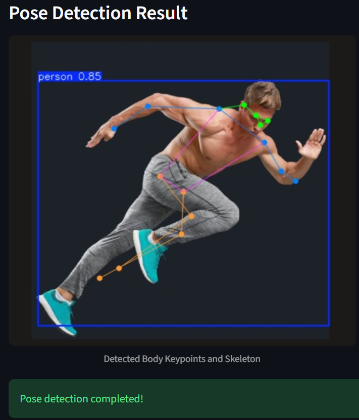

# Sports Pose Analysis

A Streamlit app that detects human body keypoints in sports images and videos using the YOLO11 pose model. For video, the app annotates each frame and lets you preview and download the processed MP4.

## Screenshots

### User Interface



### Pose Detection Result



## Requirements

- Python 3.9 or newer
- The model weights file `yolo11n-pose.pt` in the project folder, next to `sports_pose.py`

The model weights are included in this project. If they are missing, obtain the YOLO11 pose weights and place them in the project folder with that exact filename.

## Setup

Open a terminal in the project folder and install the dependencies:

```bash
python -m venv .venv
```

Activate the environment, then run:

```bash
python -m pip install -r requirements.txt
```

On Windows PowerShell, activate it with:

```powershell
.venv\Scripts\Activate.ps1
```

## Run

Start the app from the project folder:

```bash
streamlit run sports_pose.py
```

Streamlit prints a local URL to open in your browser. Choose Image or Video, then upload a supported file:

- Images: `.jpg`, `.jpeg`, `.png`
- Videos: `.mp4`, `.avi`, `.mov`, `.mkv`

For videos, processing time depends on the video length and available hardware. The processed video is available to preview and download when processing finishes.

## Notes

- The app runs inference with a confidence threshold of `0.5`.
- Ultralytics uses PyTorch for inference. CPU inference is supported; compatible CUDA/PyTorch setup can be used for GPU acceleration.